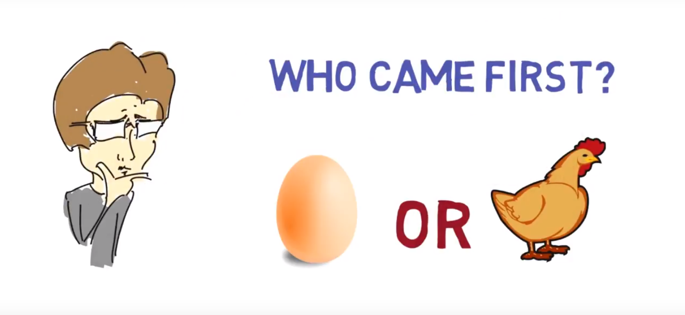

# awesome-causal-reasoning 

A curated list of Causal-Reasoning resources. Inspired by [awesome-meta-learning](https://github.com/dragen1860/awesome-meta-learning), [awesome-adversarial-machine-learning](https://github.com/yenchenlin/awesome-adversarial-machine-learning), [awesome-deep-learning-papers](https://github.com/terryum/awesome-deep-learning-papers), and [awesome-architecture-search](https://github.com/markdtw/awesome-architecture-search).

Please feel free to [pull requests](https://github.com/dragen1860/awesome-causal-reasoning/pulls) or [open an issue](https://github.com/dragen1860/awesome-causal-reasoning/issues) to add papers.

# Papers and Code

- [Improving Generalization for Abstract Reasoning Tasks Using Disentangled Feature Representations](https://arxiv.org/abs/1811.04784). Xander Steenbrugge, Sam Leroux, Tim Verbelen, Bart Dhoedt.

- [SARN: Relational Reasoning through Sequential Attention](https://arxiv.org/abs/1811.00246). Jinwon An, Sungwon Lyu, Sungzoon Cho.

- [Multi-layer Relation Networks](https://arxiv.org/abs/1811.01838). Marius Jahrens, Thomas Martinetz.

- [Dilated DenseNets for Relational Reasoning](https://arxiv.org/abs/1811.00410). Antreas Antoniou, Agnieszka Słowik, Elliot J. Crowley, Amos Storkey.

- [Compositional Attention Networks for Machine Reasoning](https://arxiv.org/abs/1803.03067). Drew A. Hudson, Christopher D. Manning. ICLR 2018. 

- [Dilated DenseNets for Relational Reasoning](https://arxiv.org/abs/1811.00410). Antreas Antoniou, Agnieszka Słowik, Elliot J. Crowley, Amos Storkey.

- [A simple neural network module for relational reasoning](https://arxiv.org/abs/1706.01427). Adam Santoro, David Raposo, David G.T. Barrett, Mateusz Malinowski, Razvan Pascanu, Peter Battaglia, Timothy Lillicrap. 

# Tutorials and Guides

# Datasets

# Researchers and Labs

- [Adam Santoro](https://scholar.google.com/citations?user=evIkDWoAAAAJ&hl=en). DeepMind.

 
